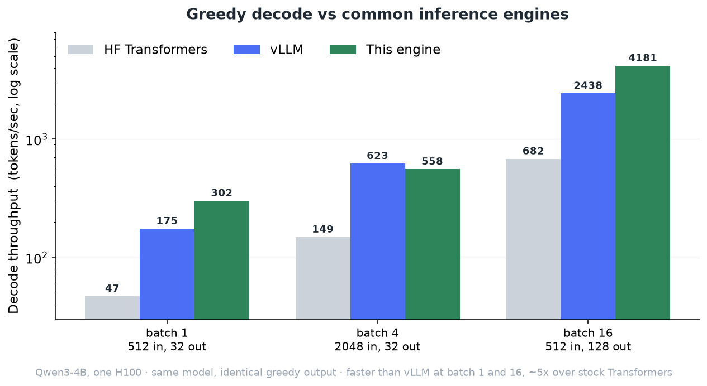
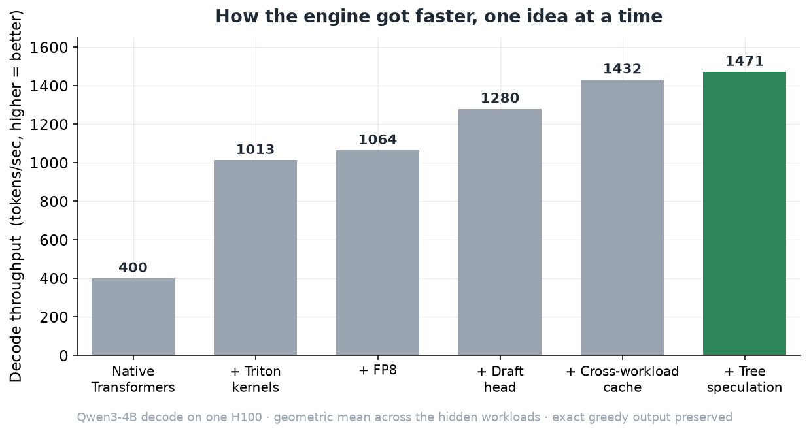

# Qwen3-4B fast decode engine — 1st place, Dryft Kernel Rush @ Hack the North

A from-scratch inference engine for **Qwen3-4B** greedy decoding on a single NVIDIA H100. It is
competitive with vLLM (faster at batch 1 and 16) and runs **4–6× faster than native HuggingFace
Transformers**, without changing a single token of the model's output.

Built for **Dryft's Kernel Rush** track at Hack the North. Final result: **1,470.8 tokens/sec,
1st of 56 teams**.

## The challenge

Take the pinned `Qwen/Qwen3-4B-Instruct-2507` checkpoint and make it decode faster on one H100.
The weights are frozen and the output is sacred: every token your engine emits must be the exact
token the model would have produced under greedy decoding (verified by replaying your output
through the reference model). You may change *how* the computation happens — kernel layout,
numeric formats, speculative execution — but never *what* it computes. No quantized or approximate
answers.

So this is pure latency work against a hard correctness wall.

## Results

Greedy decode throughput against two engines people actually use — native HuggingFace Transformers
and vLLM — on the three public workloads. Same model, same H100, identical greedy output. vLLM and
Transformers were measured directly; this engine's numbers are from the official competition run
(`tokens/sec = batch × output ÷ total time`, prefill included).

It got there in stages, each one a separate idea:

## How it works

The core observation: at batch sizes this small, decoding one token means reading all ~8 GB of
model weights from GPU memory, and that memory traffic — not arithmetic — is the bottleneck. Every
optimization either **moves fewer bytes** or **produces more tokens per weight-read**.

- **Custom Triton kernels** ([`engine/kernels/`](engine/kernels)) — fused residual+RMSNorm, a
  combined Q/K-norm + RoPE + KV-cache-write kernel, split-K grouped-query attention, and
  bandwidth-optimal skinny GEMMs for the decode matmuls. The whole decode step is captured as a
  CUDA graph and replayed, so per-launch overhead disappears.
- **FP8 matmuls** ([`engine/kernels/fp8.py`](engine/kernels/fp8.py)) — parts of the model run in
  8-bit through cuBLASLt, halving the bytes moved where the numerics allow it.
- **Speculative decoding with a self-trained draft head** — during the untimed warmup window the
  engine has the real model generate a few hundred thousand tokens of its own text, then trains a
  tiny MLP (EAGLE-style) to predict the next tokens. At decode time the small model guesses ahead
  and the full model verifies every guess in one pass, keeping only what it agrees with. Because
  the full model always has the final say, the output is bit-for-bit greedy.
- **Cross-workload cache** — the trained draft head and part of its training data persist across the
  workloads of a run, so later workloads start with a better-trained drafter for free.
- **Tree speculation** ([`engine/kernels/fused_attn.py`](engine/kernels/fused_attn.py)) — the final
  win. Instead of verifying one guess for the next token, it verifies the drafter's **top two** at
  once, using a per-token attention mask so the second candidate attends the shared prefix and
  itself but skips its sibling. Higher acceptance for essentially the same cost.

Everything stays exactly greedy; nothing above changes the model's answer.

## Layout

| Path | What it is |
| --- | --- |
| [`engine/engine.py`](engine/engine.py) | The engine: weight loading, the two-phase (prefill/decode) loop, calibration that picks the fastest strategy per workload. |
| [`engine/kernels/`](engine/kernels) | Triton kernels — attention, GEMMs, norms, FP8, speculative draft/accept. |
| [`experiments/`](experiments) | Benchmark scripts and the measurement studies behind each decision, including the dead ends. |
| `OPTIMIZATION_GUIDE.md` | Model architecture, tensor shapes, and the operation→kernel map. |
| `QWEN_ENGINE_CONTRACT.md` | The engine interface and scoring rules. |

Only `engine/` is submitted to the platform. Everything else is tooling and notes.

## Things that didn't work

The measurement scripts in `experiments/` include several ideas that looked good and weren't:

- **8-bit KV cache** — correct, but *slower*. At single-token decode the per-element conversion back
  to full precision costs more than the bandwidth a 1-byte cache saves.
- **Deeper draft chains** — the warmup calibration over-picked them; they underperformed on real
  prompts.
- The first **tree-attention** attempt was subtly wrong because it ignored that every token must
  attend to itself.

## The model

`Qwen/Qwen3-4B-Instruct-2507`, revision `cdbee75f17c01a7cc42f958dc650907174af0554`, BF16 weights,
one H100. 36 decoder layers, hidden size 2560, 32 query / 8 KV heads, SwiGLU MLP, RoPE, tied
embeddings.
